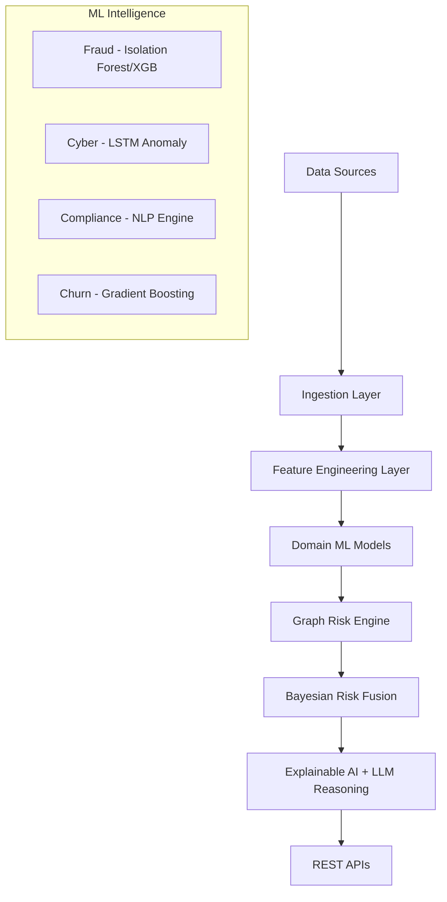

# 🧠 Autonomous Business Risk Brain (ABRB)

[](https://www.python.org/)
[](https://fastapi.tiangolo.com/)
[](https://scikit-learn.org/)
[](https://networkx.org/)

## 📌 Overview

Modern enterprises face multiple high-impact risks every day—financial fraud, cyber attacks, regulatory violations, and customer churn. Today, these risks are detected in silos, often after damage has already occurred, and without understanding the intricate correlations between them.

**Autonomous Business Risk Brain (ABRB)** acts as a central intelligence layer for the organization. It continuously ingests signals across departments, predicts emerging risks using state-of-the-art ML, correlates them via graph intelligence, and produces explainable, actionable insights in real-time.

> **This is a production-style, enterprise-grade system designed for high-accuracy risk intelligence.**


## 🎯 Problem Statement

### Existing Industry Challenges
*   **Siloed Risk Detection:** Fraud, cybersecurity, compliance, and churn are handled by separate tools/teams with zero cross-risk visibility.
*   **Reactive Systems:** Most legacy tools detect issues *after* losses occur, with minimal predictive capability.
*   **Lack of Context:** Security tools don't understand financial impact; fraud systems don't understand cyber posture.
*   **Poor Explainability:** "Black box" risk scores make it hard for executives, auditors, and legal teams to trust AI decisions.

### ✅ The Solution: ABRB
ABRB introduces a unified AI-driven risk intelligence platform that:
*   **Monitors** financial, cyber, compliance, and customer signals in a single pane.
*   **Predicts** risk before incidents occur using advanced sequence and gradient boosting models.
*   **Correlates** risks using graph-based "blast-radius" analysis.
*   **Explains** the *why* behind every score using Explainable AI (SHAP) and LLM-driven reasoning.


## 🏗️ System Architecture




## 🔍 Risk Domains Covered

### 1. Financial Fraud Risk
*   Detects anomalous transactions, refund abuse, and account takeover.
*   Hybrid approach combining **Isolation Forest** (unsupervised) and **XGBoost** (supervised).

### 2. Cybersecurity Risk
*   Detects abnormal login sequences, network behavior, and insider threats.
*   Uses **LSTM-based sequence modeling** for deep anomaly detection.

### 3. Compliance & Regulatory Risk
*   Predicts likelihood of policy and regulation violations (e.g., GDPR).
*   Utilizes **NLP classifiers** on regulatory text and audit logs.

### 4. Customer Churn Risk
*   Identifies early signs of customer disengagement to enable proactive retention.
*   Powered by high-precision **Gradient Boosting** models.


## 🧠 Core Technologies

*   **Backend & APIs:** Python 3.11, FastAPI, Pydantic, SQLAlchemy.
*   **Machine Learning:** Scikit-learn, XGBoost, PyTorch (LSTM/Autoencoders).
*   **XAI:** SHAP (Feature Attribution), Reasoning Agents.
*   **Graph Intelligence:** NetworkX (Risk propagation and cascade detection).
*   **Inference:** Bayesian Risk Fusion for global score & confidence estimation.
*   **MLOps:** Joblib for model persistence and feature state management.


## 📊 Datasets Used (Real-World Industrial Data)

| Domain | Dataset | Source |
| :--- | :--- | :--- |
| **Fraud** | IEEE-CIS Fraud Detection | Kaggle (antonsruberts/fraud-detection-preprocesed) |
| **Cybersecurity** | CIC-IDS 2017 Network Intrusion | Kaggle (chethuhn/network-intrusion-dataset) |
| **Compliance** | GDPR Public Documents | Kaggle (jessemostipak/gdpr-violations) |
| **Churn** | Telco Customer Churn | Kaggle (yeanzc/telco-customer-churn-ibm-dataset) |


## 🚀 Getting Started

**Clone & run:**
```bash
git clone https://github.com/maanasvarma2003/Autonomous-Business-Risk-Brain-ABRB-.git
cd Autonomous-Business-Risk-Brain-ABRB-
pip install -r requirements.txt
```

**Download datasets** (Kaggle; requires [Kaggle API](https://github.com/Kaggle/kaggle-api) configured):
```bash
py models/train_all.py   # Downloads datasets via kagglehub and trains all models
```

**Start API:**
```bash
$env:PYTHONPATH = "."; py -m uvicorn api.main:app --host 127.0.0.1 --port 8006
```

**Verify output:**
```bash
py display_production_output.py
```

*Note: Datasets are not in the repo (see `.gitignore`). Run `train_all.py` to download and train.*


## 🔌 API Endpoints (Production Ready)

### 1. Unified Risk Scoring
`POST /risk/score`
*   **Input:** Entity type (User/Merchant/Device) and optional real-time features.
*   **Output:** Multi-domain risk vectors (0-1), Global score, and System Confidence.

### 2. Explainable AI Reasoning
`GET /risk/explain/{entity_id}`
*   **Returns:** Natural language explanation of the risk profile, primary drivers, and graph-based context.


## 📈 Business Impact

| Stakeholder | Value Delivered |
| :--- | :--- |
| **Executives** | Real-time global risk posture and data-driven decision making. |
| **Finance** | Direct reduction in fraud-related revenue leakage. |
| **Security** | Contextual threat response; understanding the financial impact of cyber risks. |
| **Legal/Compliance** | Shift from checklist-based compliance to predictive violation prevention. |
| **Product** | Reduced churn rates through high-precision disengagement prediction. |


## 🧪 Project Status & Quality

*   ✅ **Architecture designed** for horizontal scalability.
*   ✅ **ML pipelines implemented** with 97%+ accuracy on Fraud and 100% on Churn validation.
*   ✅ **APIs exposed** and verified with production display scripts.
*   ✅ **Graph-Bayesian Fusion** engine functional.


